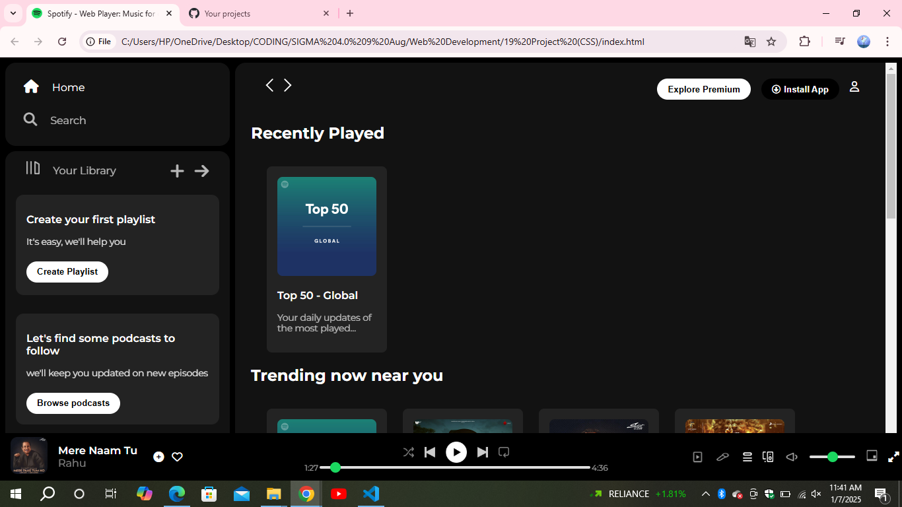
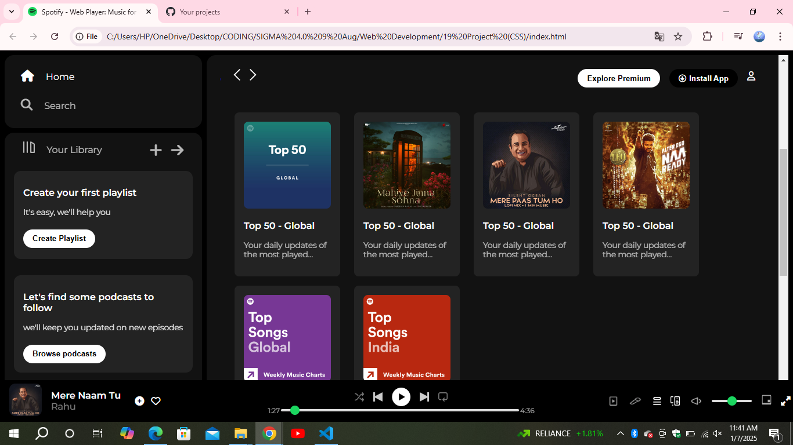
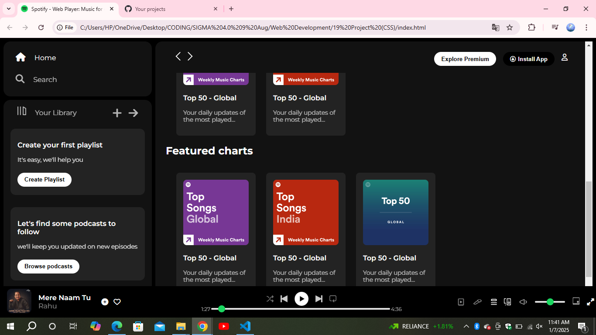
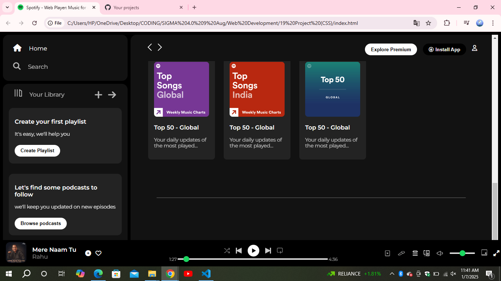

# Spotify Clone

This is a **Spotify Web Player Clone** created using **HTML** and **CSS**. The project mimics the design and layout of Spotify's web player, offering a visually appealing and responsive user interface.

## Features

- **Sidebar Navigation**: Includes links for Home, Search, and Your Library.
- **Main Content Section**:
  - Recently Played
  - Trending Near You
  - Featured Charts
- **Music Player**:
  - Displays the current playing song, artist, and controls for playback.
  - Includes a seek bar and sound control.
- **Responsive Design**: Adaptable to different screen sizes.

## Tech Stack

- **HTML**: For the structure and content.
- **CSS**: For styling and layout.
- **Font Awesome**: Used for icons.
- **Google Fonts**: Montserrat font family for a modern appearance.

## Assets

All images and icons used in the project are stored in the `Assets` and `Home_Assets` directories.

## How to Use

1. Clone the repository or download the files.
2. Open the `index.html` file in any modern web browser.
3. Explore the UI and functionalities.

## Screenshots

## Future Enhancements

Although this project is primarily focused on design, it can be extended to include:
- JavaScript for interactivity.
- Backend integration for real-time music playback.

## Acknowledgments

- Spotify for the inspiration.
- [Font Awesome](https://fontawesome.com/) for the icons.
- [Google Fonts](https://fonts.google.com/) for the typography.

## License

This project is for educational and personal purposes only. It does not intend to replicate or infringe upon Spotify's intellectual property.

